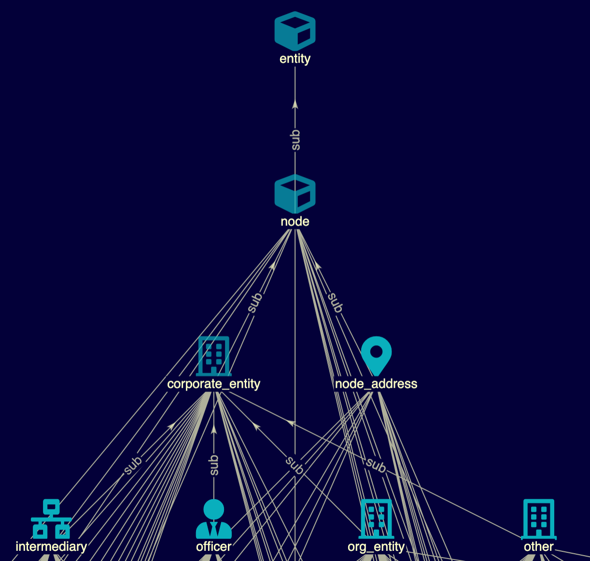

# TypeDB Offshoreleaks Database

### Tune in to the [live webinar](https://www.meetup.com/typedb-london/events/283478691/) Thursday February 17th at 17:30 GMT!
### Intro

The Pandora Papers consist of 11.9 million documents leaked from 14 financial service providers and obtained by the International Consortium of Investigative Journalists (ICIJ). The first stories based on the leaks appeared in print on 3 October 2021, with relevations about the secretive and often questionable financial dealings of heads of state, oligarchs, celebrities, local straw men and the accountants and lawyers providing offshore services.

A processed text version of the leaked documents, combined with data from earlier troves of leaks (Offshore Leaks, Bahama Papers, Panama Papers, Paradise Papers), were made available by the ICIJ as a single dataset - the Offshore Leaks - in early December 2021. The text files consist of tables of entities, officers, intermediaries and other types, and pairwise relationships between them. 

Here, we clean and reformat the tabular data, create a simple schema, and import the whole dataset into TypeDB. 

### Schema 

#### Entity types


Porting the dataset into TypeDB gives us some advantages over traditional property graphs, such as

1. Type inference: a simple [Type hierarchy](https://docs.vaticle.com/docs/schema/overview#typedb-data-model) makes it possible to query for an abstract type, such as `corporate entity` or `directed relation`, and match all subtypes.
2. Rule inference: [TypeDB rules](https://docs.vaticle.com/docs/schema/rules) allow us to derive inferred facts automatically when querying. 

For example, the schema provided here includes the rule `same_date_stop_rule`, which infers a possible relationship between legal entities closed on the same date - leveraging both Type inference (matching all types of stopping events) and Rule inference (inferring new facts). 

### Example query
[Shakira](https://www.icij.org/investigations/paradise-papers/6069/)

"match $x isa officer, has name contains 'Shakira Isabel Mebarak Ripoll';"

### Dataset stats:
* 803,089 org_entities
* 747,001 officers
* 26,775 intermediaries
* 2,920 others
* 391,069 addresses
* 3,273,525 relations
## Quick start

Prerequisites: 
* `wget` or `curl`
* `sed`
* Python >3.6
* R 3.6
* [TypeDB Core](https://vaticle.com/download#core) 2.6.x 
* [TypeDB Python Client](https://docs.vaticle.com/docs/client-api/python) 2.6.x

### Clone this repository to your computer

```shell
git clone https://github.com/typedb-osi/typedb-data-offshoreleaks.git && cd typedb-data-offshoreleaks
```

### Download and preprocess the datasets

```shell
bash ./preprocess.sh
```

### Start TypeDB and migrate the data into the database

in a separate terminal, start TypeDB
```shell
# let java use up to 16GB of memory
JAVAOPTS="-Xmx16G" typedb server
```
Back in the original terminal, set up the Python environment
```
python3 -m venv .venv
source .venv/bin/activate
pip install -r requirements.txt
```

then run the migrator.py script to import the data into TypeDB
```shell
# run the migrator with 4 separate processes
python3 ./migrator.py -n 4
```
For options:

```shell
python3 ./migrator.py -h
```
### Start querying the database

To query the database, either use [TypeDB console](https://docs.vaticle.com/docs/console/console) or download a graphical user interface (GUI). 

A free GUI is [TypeDB Studio](https://github.com/vaticle/typedb-studio).

Nodelab, the GUI used for the examples above, has advanced presentation and query features, and will be available shortly (contact [Jon Thompson](https://www.linkedin.com/in/jonatanthompson/) for information)

## Licence

The data was first made available by the International Consortium of Investigative Journalists (ICIJ) under the [Open Database License](http://opendatacommons.org/licenses/odbl/1.0/) and the [Creative Commons Attribution-ShareAlike](http://creativecommons.org/licenses/by-sa/3.0/) license. It is re-published here under the same licences. 
The data should be used under the same terms set out on the ICIJ website: https://offshoreleaks.icij.org/pages/database.

## Credits
[Jon Thompson](https://www.linkedin.com/in/jonatanthompson/)